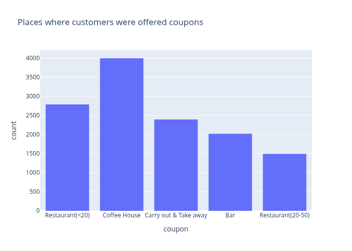
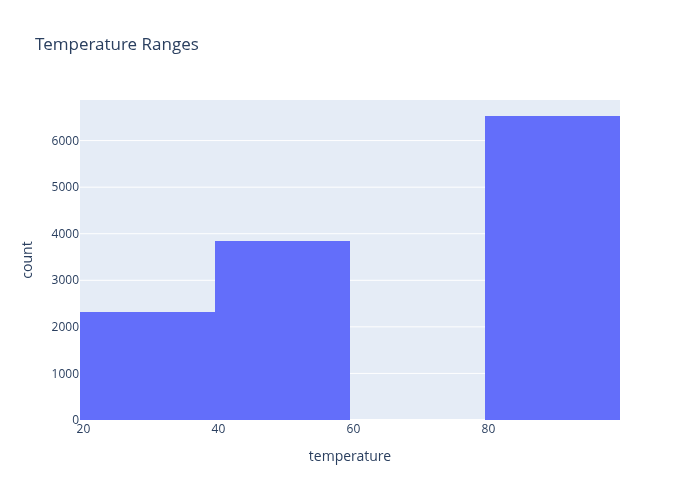
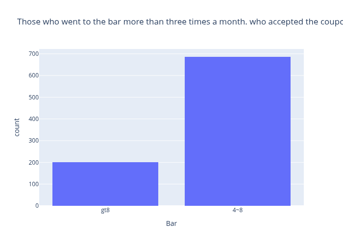
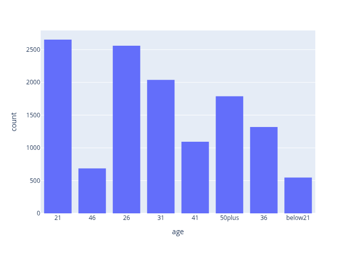
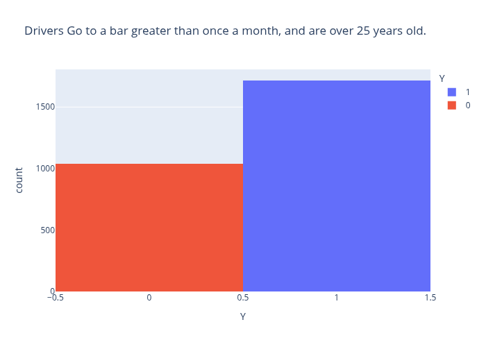
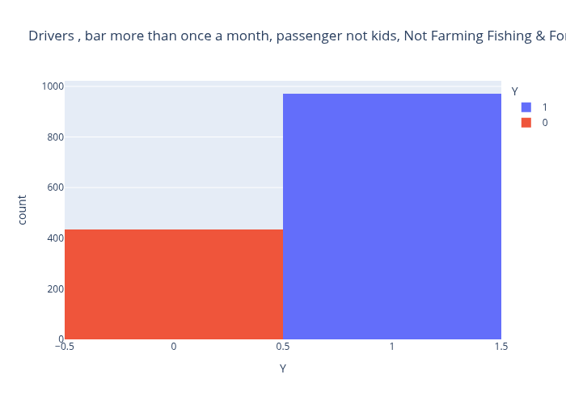
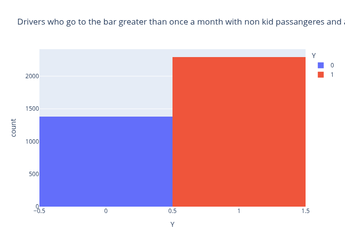
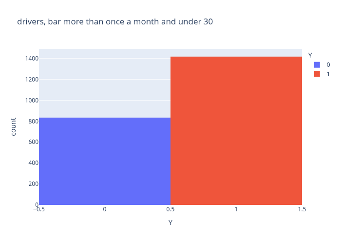
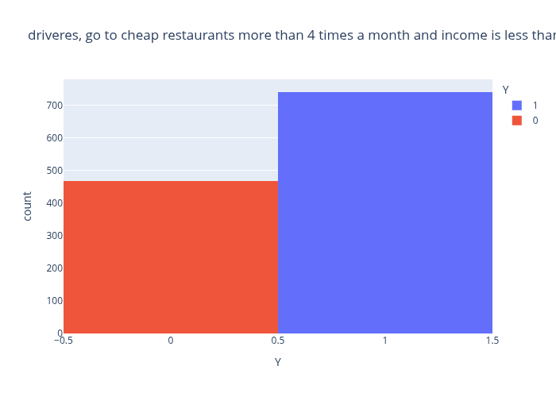
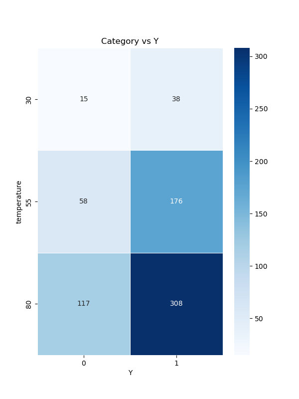

# Coupons Dataset

    
## Introduction

This is the summary of data exploration contained on the Jupyter Notebook. 
1. Guided quesions [5.1 Questions](./notebooks/prompt-work.ipynb)
1. Independent investigation [Independent](./notebooks/prompt-work-independent.ipynb)

## Guided Questions
### Data Cleaning
#### 1. Nan Values

 A subset of the 26 columns had Nan values.
  These were cleaned up with  

```data['car'] = data['car'].fillna('')``` 


| Column  | Nan Count | 
| --- | --- | 
| car| 12576 | 
| Bar| 107| 
|CoffeeHouse|217
|CarryAway|151|
|RestaurantLessThan20 | 130 |
|Restaurant20To50|189|

#### 2. Empty Values

The **car** column only had 108 filled values 
* Scooter and motorcycle,
* crossover,
* Mazda5,
* do not drive,
* Car that is too old to install Onstar :D

The Car column is less than 1 percent of the data, but it is interesting. Perhaps is we isolate the labeled cars we might see that folks that 'do not drive' or use 'Scooter and motercle' may be more amenable to using a coupon.

The decision was made to keep these values

#### 3. Duplicate Rows

```len(data[data.duplicated() == True])``` revealed 74 duplicate rows.

74 of the 12684 rows are duplicates. Its unclear if these are problems with the data or if the two individual of the same profile were surveyed at the same time. Given the time is a rough measure of time - no minutes or seconds - is it possible that more than one person who met the same profile were surveyed. Perhaps they were together? Even if they are duplicates they represent 0.6 percent of the data, so we will keep them in.

## Directed Analysis

### Bar Customers

#### 1. What proportion of the total observations chose to accept the coupon?

7210 of 12684 or 57 percent of the observations accepted the coupon

#### 2.  Use a bar plot to visualize the coupon column.
 


#### 3. Use a histogram to visualize the temperature column.




#### 4.  What proportion of bar coupons were accepted?
827 of 2017 or 41 percent of individuals in the Bar used the coupon

#### 5. Compare the acceptance rate between those who went to a bar 3 or fewer times a month to those who went more.

* those who went to a bar 3 or fewer times a month




* those who went more



#### 6. Compare the acceptance rate between drivers who go to a bar more than once a month and are over the age of 25 to the all others. Is there a difference?

* drivers who go to a bar more than once a month and are over the age of 25

For this analysis ```data[data['car'] != 'do not drive'] # remove 'do not drive']```  removed the non-drivers.



* all the others


#### 7. Use the same process to compare the acceptance rate between drivers who go to bars more than once a month and had passengers that were not a kid and had occupations other than farming, fishing, or forestry.¶



#### 8. Ccompare the acceptance rates between those drivers who:

*  go to bars more than once a month, had passengers that were not a kid, and were not widowed 



*  go to bars more than once a month and are under the age of 30 OR



*  go to cheap restaurants more than 4 times a month and income is less than 50K.


Sixty-one percent of drivers who do to less than 20 dollar restaurants, more than 4 times a month, and make less than 50K use coupons.


---

## Independent Investigations
### Expensive Restaurants

Looking at the set of individuals at Restaurant20To50, some exploratory experimentation yielded interesting results.

* 264 individuals went to expensive restaurants, and 175 or sixty-six percent accepted coupons
* If these individual had kids the positive rate was 55 percent
* With friends the yes ratio is 69%

| Restaurant20To50  | Count  | Yes | Coupon Acceptance Rate| 
| --- | --- | --| --|
| | 264 | 175 | 66% | 
| With Kids| 11| 6 | 54%|
| With Friends| 91 |63| 69%|
|With Pargner|5|5|65%|

### Above 50 years old
| 50plus  | Count  | Yes | Coupon Acceptance Rate| 
| --- | --- | --| --|
| | 473 | 280 | 59% | 
| With Friends| 91 |63| 69%|
|Alone|1595|875|55%|

### Young - 21, 26 or 31
| Young  | Count  | Yes | Coupon Acceptance Rate| 
| --- | --- | --| --|
| | 7251 | 4226 | 58% | 
| With Friends| 1906 |1332| 70%|
|Alone|4240|2266|54%|

### Coffee House - Greater than 8 times a month
| Coffee House gt8  | Count  | Yes | Coupon Acceptance Rate| 
| --- | --- | --| --|
| | 1111 | 648 | 58% | 
| With Friends| 1906 |1332| 70%|
| With Kids| 516 |284| 55%|
| With Friends| 286 |191| 67%|
|Alone|666|366|55%|

### Young - (21, 26 or 31), Coffee House, With Friends, Greater than 8 times a month

|   | Count  | Yes | Coupon Acceptance Rate| 
| --- | --- | --| --|
| | 173 | 117 | 68% | 
| 7AM| 0 || |
| 2PM| 66 |51| 77%|
| 10PM| 33 |20| 60%|

### Category Work
For this analysis I learned how to use the astype('category') command to turn categorical values into something plottable by seaborn. 
```
for col in df.columns:
    df[col] = df[col].astype('category')
```
Then by using the pandas crosstab command I was able to render seaborn heatmaps with a category compared to 'Y'. The following are seaborn heat maps for a collection of categories.







## Conclusion


